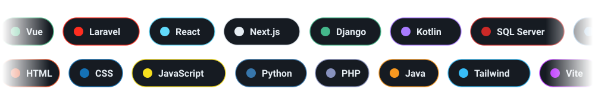
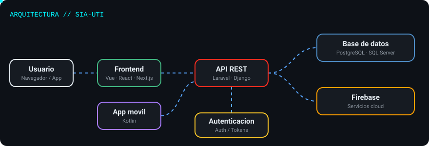

<!-- Michael383883/Michael383883 -> README.md (las imagenes estan en /assets) -->

## 💻 Terminal

## 🧰 Tech Stack

## 📊 GitHub Stats

## 🐍 Snake Pro

## 📈 Actividad del año

## 🏆 Trofeos

## 🚀 Proyectos

### SIA-UTI

| Modulo | Tecnologia | Codigo |
|:--|:--|:--|
| 🎨 Frontend | Vue / React | [ver codigo](https://github.com/Michael383883/SIA-UTI/tree/main/frontend) |
| ⚙️ Backend | Laravel / Django | [ver codigo](https://github.com/Michael383883/SIA-UTI/tree/main/backend) |
| 🗄️ Database | PostgreSQL / SQL Server | [ver codigo](https://github.com/Michael383883/SIA-UTI/tree/main/database) |
| 🔌 API | REST | [ver codigo](https://github.com/Michael383883/SIA-UTI/tree/main/api) |
| 🔐 Authentication | Tokens / Roles | [ver codigo](https://github.com/Michael383883/SIA-UTI/tree/main/auth) |
| 📚 Documentation | Markdown | [ver docs](https://github.com/Michael383883/SIA-UTI/tree/main/docs) |
| 📸 Screenshots | Capturas | [ver capturas](https://github.com/Michael383883/SIA-UTI/tree/main/screenshots) |

## 🧩 Arquitectura

## 📫 Contacto

